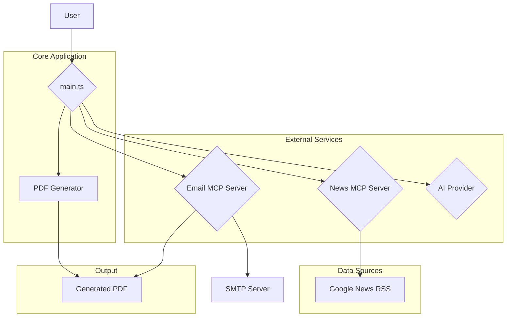

# System Patterns: Personalized News and Content Curator

## 1. System Architecture

The application is designed with a modular, service-oriented architecture that leverages the Model Context Protocol (MCP) for inter-service communication. This approach decouples the core application logic from the external services it relies on, such as news fetching and email delivery.

### Architectural Diagram:

### Components:

-   **`main.ts` (Orchestrator)**: The central component that drives the application workflow. It coordinates the interactions between the user, the MCP servers, the AI provider, and the PDF generator.
-   **News MCP Server (`mcp/news/news-mcp-server.ts`)**: A dedicated service responsible for fetching news articles. It abstracts the details of the news source and provides a simple interface for the main application.
-   **Email MCP Server (`mcp/email/email-mcp-server.ts`)**: A service that handles email delivery. It encapsulates the complexities of interacting with an SMTP server and sending attachments.
-   **`news-fetcher.ts` (Tool)**: A utility used by the News MCP Server to scrape news from Google News RSS feeds.
-   **`pdf-generator.ts` (Module)**: A module that takes the curated content and generates a formatted PDF document.
-   **AI Provider (`@juspay/neurolink`)**: An external library used to summarize the fetched news articles.

## 2. Key Design Patterns

-   **Service-Oriented Architecture (SOA)**: The use of MCP servers for news and email functionalities promotes a loosely coupled system where services can be developed, deployed, and scaled independently.
-   **Facade Pattern**: The MCP servers act as facades, providing a simplified interface to the more complex underlying systems (Google News RSS, SMTP server).
-   **Strategy Pattern**: The `createBestAIProvider` function from `@juspay/neurolink` likely employs a strategy pattern to select the optimal AI model for the summarization task.
-   **Asynchronous Processing**: The entire workflow is asynchronous, using Promises and `async/await` to handle I/O-bound operations like fetching news, calling the AI provider, and sending emails without blocking the main thread.

## 3. Data Flow

1.  The `main.ts` script prompts the user for topics and an email address.
2.  For each topic, it calls the News MCP Server.
3.  The News MCP Server uses the `news-fetcher` tool to get articles from Google News.
4.  The articles are returned to `main.ts`.
5.  `main.ts` iterates through the articles and uses the AI Provider to generate summaries.
6.  The curated content (articles and summaries) is passed to the `pdf-generator`.
7.  The `pdf-generator` creates a PDF and saves it to the local filesystem.
8.  `main.ts` calls the Email MCP Server with the recipient's email and the path to the generated PDF.
9.  The Email MCP Server sends the email with the PDF attachment.

## 4. Critical Implementation Paths

-   **MCP Communication**: The `executeMCPCommand` function in `main.ts` is critical for the interaction between the core application and the MCP servers. Its reliability is key to the system's functioning.
-   **Error Handling**: The system includes error handling at multiple levels (fetching news, summarizing, sending email) to ensure that failures in one part of the process do not crash the entire application.
-   **Configuration Management**: The use of `.env` files for sensitive information (API keys, email credentials) and `.mcp-config.json` for server configurations is a crucial aspect of the system's design.
